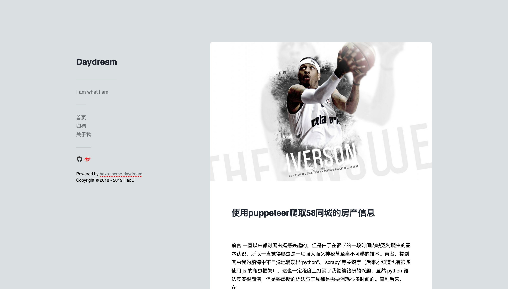

<h1 align="center">hexo-theme-A-Daydream</h1>
<p align="center">
  <a href="https://www.npmjs.com/package/daydream" target="_blank">
    
  </a>
  <a href="https://github.com/chaos1ee/hexo-theme-A-Daydream#readme" target="_blank">
    
  </a>
  <a href="https://github.com/chaos1ee/hexo-theme-A-Daydream/graphs/commit-activity" target="_blank">
    
  </a>
  <a href="https://github.com/chaos1ee/hexo-theme-A-Daydream/blob/master/LICENSE" target="_blank">
    
  </a>
</p>

> 一款简洁的hexo主题



<<<<<<< HEAD
### 🏠 [主页地址](https://github.com/chaos1ee/hexo-theme-A-Daydream#readme)
=======
### 🏠 [主页地址](https://github.com/maybeeee/hexo-theme-A-Daydream#readme)
>>>>>>> 22ee1c555132ffa48643b2f02d55db7c81fc5807

## 使用方式

### 下载主题

```sh
<<<<<<< HEAD
git clone https://github.com/chaos1ee/hexo-theme-A-Daydream themes/daydream
=======
git clone https://github.com/maybeeee/hexo-theme-A-Daydream themes/daydream
>>>>>>> 22ee1c555132ffa48643b2f02d55db7c81fc5807
```

修改hexo博客根目录下的`_config.yml`文件，将theme改为daydream。

### 安装依赖

注意：安装到项目根目录下

```sh
npm install hexo hexo-asset-image hexo-generator-archive hexo-generator-category hexo-generator-index hexo-generator-tag hexo-i18n hexo-renderer-markdown-it hexo-renderer-pug hexo-renderer-sass
```

### evanyou

修改主题配置文件`_config.yml`，控制是否开启彩色丝带背景。

```yaml
# evanyou
evanyou: true
```

### 评论

支持的评论方式为“来必力”，先在官网注册后获取引入“来必力”的uid，填入主题目录下的`_config.yml`文件。

```yaml
# comment
comment:
  livere: MEUyMCxx0NjIyOC8yMjczOQ==
```

## Author

<<<<<<< HEAD
👤 **LiHao**

* Github: [@chaos1ee](https://github.com/chaos1ee)

## 🤝 Contributing

Contributions, issues and feature requests are welcome!<br />Feel free to check [issues page](https://github.com/chaos1ee/hexo-theme-A-Daydream/issues).
=======
👤 **haoli**

* Github: [@maybeeee](https://github.com/maybeeee)

## 🤝 Contributing

Contributions, issues and feature requests are welcome!<br />Feel free to check [issues page](https://github.com/maybeeee/hexo-theme-A-Daydream/issues).
>>>>>>> 22ee1c555132ffa48643b2f02d55db7c81fc5807

## Show your support

Give a ⭐️ if this project helped you!